# 🛡️ MediGuard AI — Agentic AI-Based Fraud Detection & Recommendation System

MediGuard AI is a multi-agent, AI-powered system for detecting fraudulent activity within the healthcare ecosystem — flagging suspicious behavior by doctors, patients, or any other party involved in a claim. It combines graph-based knowledge retrieval, large language model reasoning, and generative adversarial networks to analyze claims and generate structured, explainable fraud reports.

This project was developed as a Final Year Project (FYP) for a BS Software Engineering degree.

---

## 📌 Overview

Healthcare fraud is often difficult to detect using rule-based systems alone. MediGuard AI addresses this by combining:

- **Multi-agent orchestration** to break fraud detection into specialized, coordinated steps
- **Retrieval-Augmented Generation (RAG)** grounded in official policy documents (Medicare Benefit Policy Manual)
- **Graph-based relationship analysis** to uncover hidden connections between doctors, patients, and claims
- **Synthetic data generation (GANs)** to support model training and testing under realistic but privacy-safe conditions

The system analyzes each claim and flags fraudulent behavior — whether committed by a doctor, a patient, or any other actor involved — and outputs a clear recommendation: **APPROVE**, **REJECT**, or **INVESTIGATE**, along with a structured, human-readable justification.

> **Note:** The current system does not involve any insurance company logic — the scope is limited to detecting fraud across claims, doctors, and patients.

---

## ✨ Features

- 🤖 Multi-agent pipeline built with **LangGraph** for fraud scoring, investigation, and recommendation
- 📚 RAG pipeline using **FAISS** vector search over the Medicare Benefit Policy Manual
- 🕸️ **Neo4j** graph database for modeling relationships between claims, doctors, and patients
- 🧠 **Groq LLM (LLaMA 3.3 70B)** for fast, structured natural-language fraud analysis
- 🧪 Dual GAN models (**DCTGAN** and **TTSGAN**) for synthetic transaction and time-series data generation
- 🖥️ **React** frontend with role-based navigation (Admin, Staff, Doctor, Patient)
- ⚡ **FastAPI** backend serving REST endpoints consumed by the frontend

---

## 👥 User Roles

| Role | Access |
|---|---|
| **Admin** | Full system oversight and management |
| **Staff** | Review and process claims/reports |
| **Doctor** | Submit/view claims relevant to their patients |
| **Patient** | View their own claims and reports |

---

## 🏗️ Architecture

### System Architecture
Shows how the frontend, backend, orchestration agent, detection agent, and database layer connect and communicate.

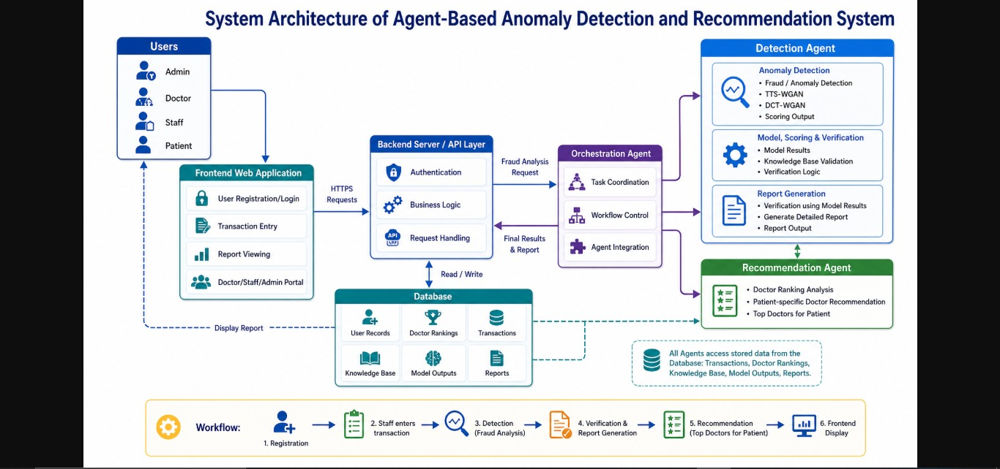

### Agentic Framework Workflow
Shows the step-by-step flow: transaction sequence generation → model processing (TTS/DCT-GAN) → detection & risk classification → investigation → scoring & ranking → RAG-based report generation → doctor recommendation → final patient output.

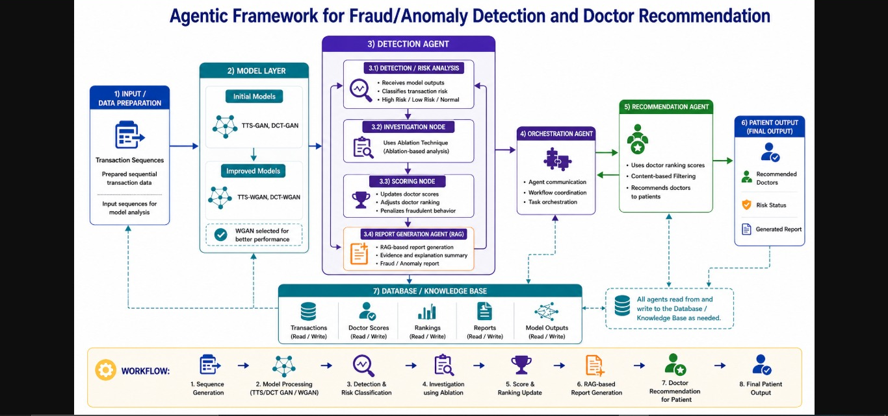

---

## 🖼️ Screenshots — Application Flow

### 1. Landing Page
Introduces MediGuard AI to hospital management with a quick overview of what the system does.


### 2. About Us — Key Stats & Overview
Highlights detection accuracy, transactions analyzed, and doctors monitored, along with core capabilities (anomaly detection, fraud prevention, risk scoring).

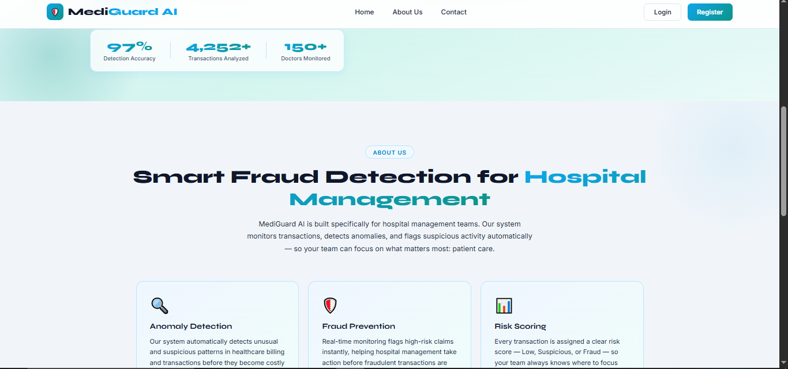

### 3. About Us — Features & Contact
Additional features (human review, detailed reports, real-time monitoring) and contact information.

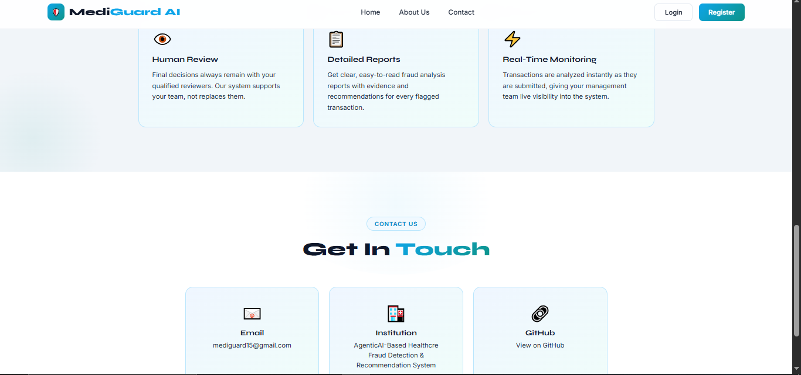

### 4. Register — Select Role
New users choose their role: Admin, Doctor, Billing Staff, or Patient.

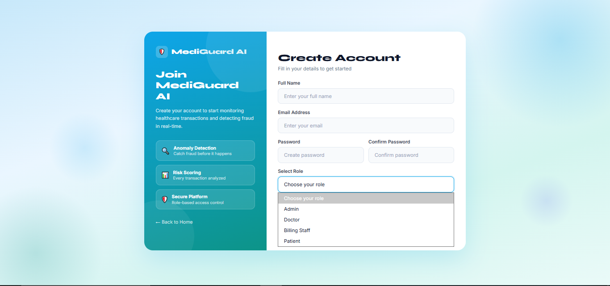

### 5. Register — Doctor (PMDC Verification)
When registering as a Doctor, a valid **PMDC Registration Number** is required to verify their medical license before an account is created.

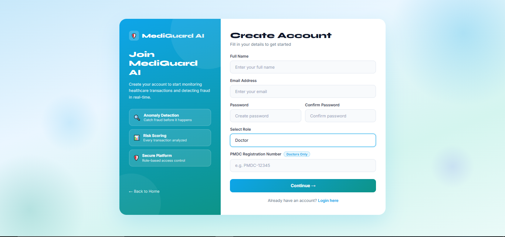

### 6. Login
Registered users sign in to access their role-based dashboard.

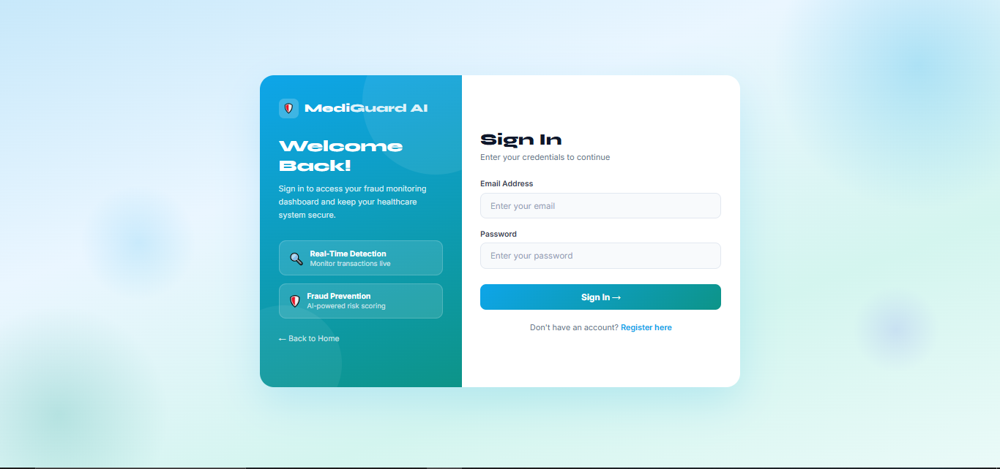

### 7. Dashboard — Overview
Displays a summary of total transactions, fraud detected, suspicious cases under review, and doctors currently being monitored.

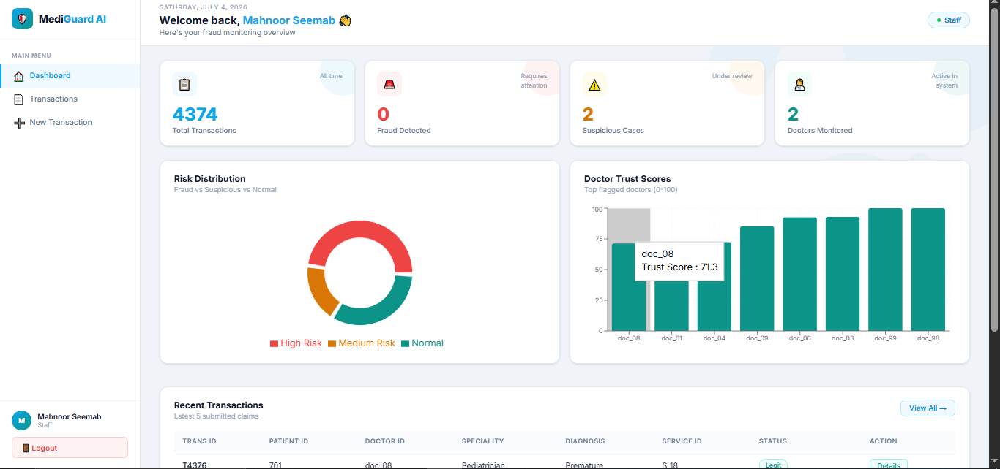

### 8. Dashboard — Risk Distribution & Recent Transactions
Visual breakdown of risk levels (High/Medium/Normal), doctor trust scores, and the most recently submitted claims.

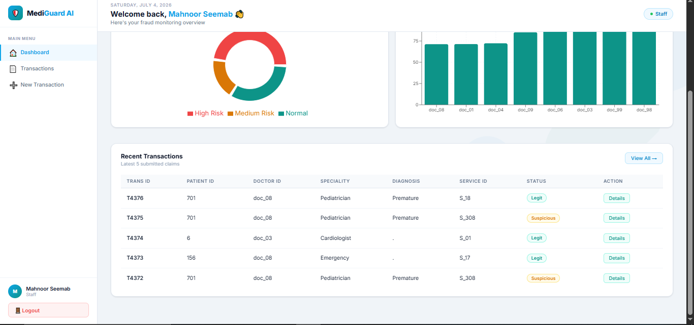

### 9. All Transactions
Complete transaction history with fraud analysis status for each claim.

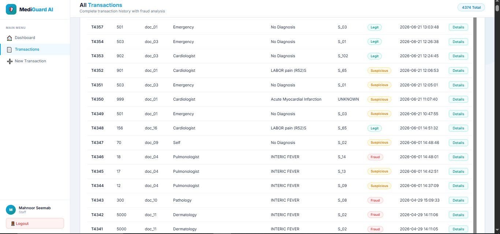

### 10. New Transaction
Form used to submit a new claim (Patient ID, Doctor ID, Speciality, Diagnosis, Service Description) for fraud analysis.

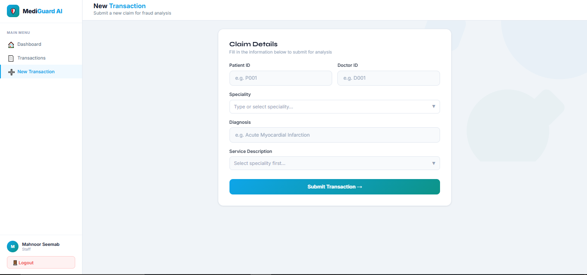

### 11. Transaction Details
Shows the submitted claim details alongside a quick risk analysis summary (risk score, risk level, final status).

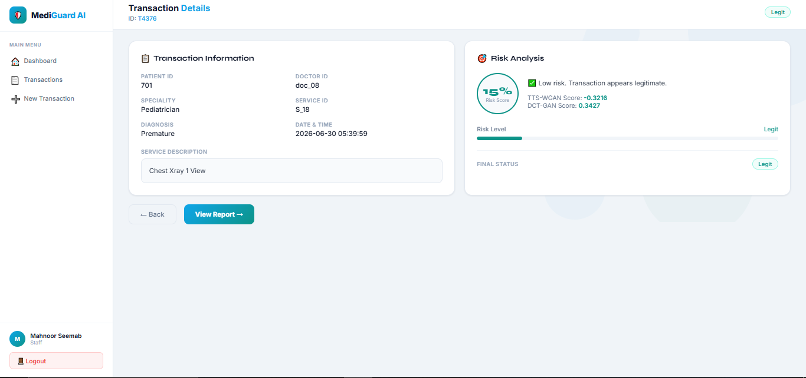

### 12. Fraud Report — Summary
Full transaction information and risk analysis for a specific claim.

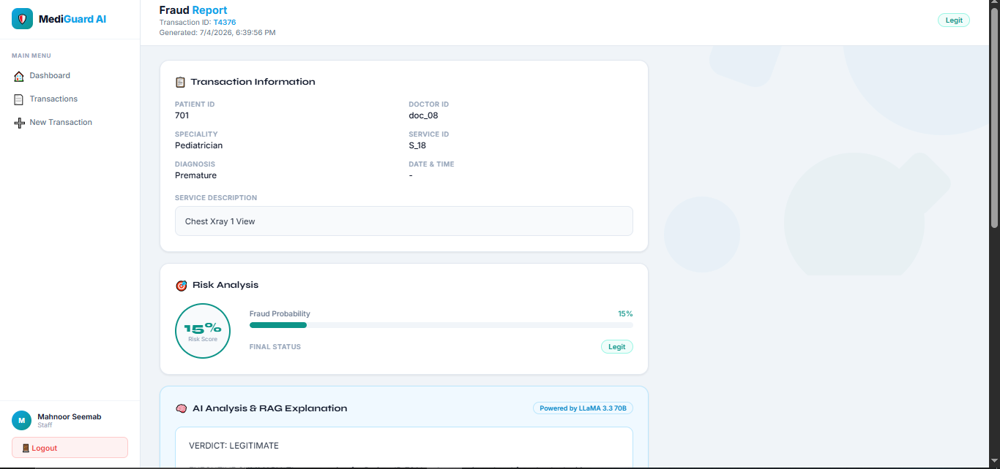

### 13. Fraud Report — AI Analysis & RAG Explanation
Detailed, LLM-generated explanation (powered by LLaMA 3.3 70B) covering the verdict, transaction analysis, and clinical reasoning behind the decision.

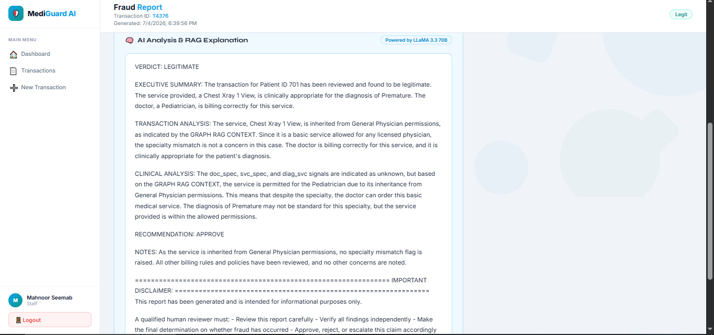

### 14. Fraud Report — Recommendation & Disclaimer
Final recommendation (Approve/Reject/Investigate) with a disclaimer noting that a qualified human reviewer must verify the report before final action.

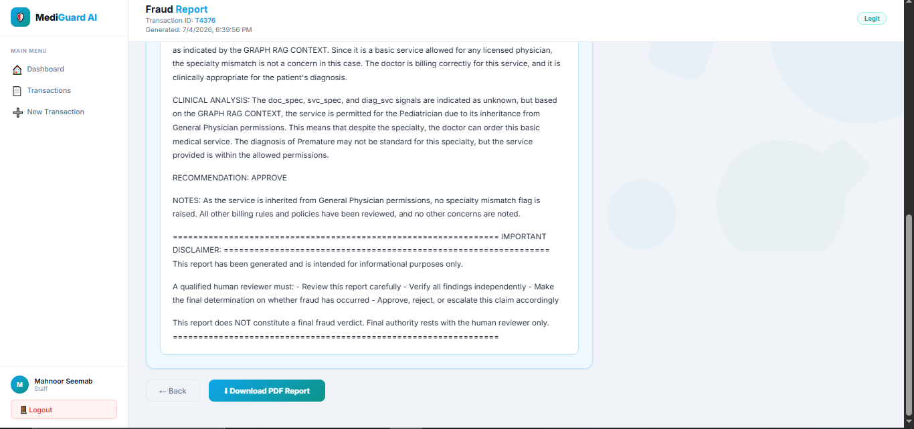

---

## 🛠️ Tech Stack

| Layer | Technology |
|---|---|
| Frontend | React.js |
| Backend | FastAPI (Python) |
| Orchestration | LangGraph (multi-agent workflows) |
| LLM | Groq API — LLaMA 3.3 70B |
| Vector Search | FAISS |
| Graph Database | Neo4j |
| Synthetic Data | DCTGAN, TTSGAN |
| Language | Python, JavaScript |

---

## 📂 Project Structure

```
newFYP/
├── fyp-frontend/                      # React frontend
│   ├── public/
│   └── src/
│       ├── assets/                    # Images/icons
│       ├── components/
│       │   ├── Navbar.jsx
│       │   └── ProtectedRoute.jsx
│       ├── pages/
│       │   ├── AllTransactions.jsx
│       │   ├── Dashboard.jsx
│       │   ├── LandingPage.jsx
│       │   ├── Login.jsx
│       │   ├── Recommendation.jsx
│       │   ├── Register.jsx
│       │   ├── Transaction.jsx
│       │   └── ViewReport.jsx
│       ├── styles/                    # Per-page CSS files
│       ├── App.js
│       └── index.js
│
└── new_backend/                       # FastAPI backend
    ├── agent1/                        # Scoring & investigation agent
    │   ├── nodes/
    │   ├── agent1_graph.py
    │   └── state.py
    ├── agent2/                        # Retrieval agent
    │   ├── nodes/
    │   ├── agent2_graph.py
    │   └── state.py
    ├── agent3/                        # Recommendation agent
    │   ├── nodes/
    │   ├── agent3_graph.py
    │   └── state.py
    ├── models/                        # Trained GAN model weights
    │   ├── dctgan_generator.pth
    │   ├── dctgan_discriminator.pth
    │   ├── ttsgan_generator.pth
    │   ├── ttsgan_discriminator.pth
    │   ├── encoders.pkl
    │   ├── feature_maxes.npy
    │   ├── feature_medians.json
    │   └── vocab_sizes.pkl
    ├── rag/                           # RAG pipeline
    │   ├── faiss_index/
    │   ├── knowledge_base/
    │   ├── graph_retriever.py
    │   ├── kb_loader.py
    │   ├── llm_analyzer.py
    │   ├── neo4j_builder.py
    │   └── retriever.py
    ├── main.py                        # FastAPI entry point
    ├── database.py
    ├── crud.py
    ├── recommendation.py
    ├── dctgan_inference.py
    ├── dctgan_loader.py
    ├── ttsgan_inference.py
    ├── ttsgan_loader.py
    ├── id_mappings.py
    ├── import_data.py
    ├── sequence_pairs.py
    └── requirements.txt
```
